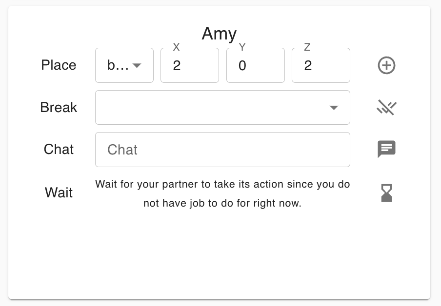

# CoBlock
*Your Co-Workers Matter: Evaluating Collaborative Capabilities of Language Models in Blocks World [[PDF]](./static/paper-coblock.pdf)*

*Guande Wu, Chen Zhao, Claudio Silva, He He*

*New York University, NYU Shanghai*


## CoBlock Environment
CoBlock is a multi-agent platform designed to explore the intricacies of multi-agent collaboration within a 3D blocks world. CoBlock is specifically crafted to evaluate the collaboration between LLM agents and human users. We provide a web interface for the human agent to interact with the LLM agents under the 3D block world.


Within the interface, both human and LLM agents are endowed with the ability to manipulate the environment by placing or breaking blocks. They can also communicate with each other to strategize and work collaboratively towards shared objectives. 
Contrary to traditional human-LLM collaborative setups, such as the ChatGPT, CoBlock envisions a scenario where agents are positioned as equals. Each agent possesses individual goals and an inventory, necessitating a mutual exchange of assistance to successfully accomplish their respective tasks. This setting provides deeper insights into cooperative behavior, negotiation strategies, and the division of labor between artificial intelligence and human operators.

## FAQ
**Q: What is the block world?**

*A: The block world refers to the simulated world consisting of the block structures. In the world, the agent typically can place the new block, break the existing block and walk. The most famous example is Minecraft. CoBlock is a simplified version of Minecraft developed for evaluating human-LLM collaboration. We run the whole system in web so we can easily conduct crowd-sourcing experiments.*

**Q: Why do not we just use Minecraft?**

*A: Minecraft is indeed an excellent platform for researching human-LLM collaboration. However, it requires installation on a PC, and ensuring that crowdsourcing workers have access to the software on their computers can be challenging. In contrast, CoBlock is implemented as a webpage, offering superior accessibility.*

**Q: What is the difference between CoBlock and other human-LLM collaboration platforms?**

*A: CoBlock distinguishes itself by treating human and LLM agents as equals. Envisioning a future where LLM agents serve as company representatives, they will collaborate with counterparts from other firms. In this scenario, LLM agents are not merely assistants but entities with their own objectives, capable of seeking human assistance.*

**Q: How do we evaluate the collaboration result**

*A: We define a series of metrics including the success rate, task time and workload balance to evaluate the collaboration result. Please look into our paper for more details.*


## Installation
We recommend using docker-compose to deploy CoBlock system. You need to first install [docker](https://www.docker.com) and [docker-compose](https://docs.docker.com/compose/). 
To use GPT-based LLM agents, you need to config your own OpenAI API key in `docker-compose.yaml` file. For applying OpenAI API key, please refer to the [page](https://platform.openai.com/docs/api-reference).

After docker and docker-compose are installed, you can simply run the following command to start the system:
```
docker-compose up
```
Then you can access the page from `localhost:3000`.
For the deployment running, you need run the following command:
```
ENVIRONMENT=PROD && docker-compose up
```
It will use the docker images designed for the deployment environments. If you want to deploy CoBlock service on the cloud servers such as Amazon AWS, you need to config the hostname in `nginx/prod.conf`. During the system development, we initially use the name *minechat*, so the folder name in this project remains to be same.


## Loading Data
The task structures and settings in our paper are available in [Google Drive](https://drive.google.com/file/d/1h_YNeHA0peroIr_1JcMAxCY-d4X9HTZl/view?usp=share_link)
To use them, you need to first load the data by running the following command. 
```
cd minechat_backend
python manage.py loaddata data.json
```

## System Usage
After openning the page, you need to define the goal structure and task setting (you can also use the prepared data). To create a new structure, please access the page `localhost:3000/creator`. To create a new task setting, please access the page `localhost:3000/task-config`. After completing the task definition, you will be prompted to a new page with the task id. In this page, you can start the task there.

In the page, there will be the goal structure shown in 3D and in text:
<!--  -->


Then you can execute the actions of placing, breaking, communicating and waiting the page.
<!--  -->

In the environment, the user's goal is to complete a target structure with an AI partner. you and your AI partner will perform the actions turn-by-turn. In each turn, you can only perform three actions. Your partner LLM agent will automatically work with you if you set API key properly in the previous step. For more detail tutorial, please refer to [tutorial](./static/user-tutorial.pdf).

## Code Structure
```
./nginx # Nginx config for the server
./web-portal # Code for the front-end application
./minechat_backend # Code for the back-end server
```
If you want to contribute to the system or develope on our codebase, please follow the coding schema shown in the code files. You can add new page in `./web-portal` and create new API in `./minechat_backend`.

- Adding New Pages to ./web-portal: This directory houses our web portal's frontend components. We use Typescript and React. Also, we use [MUI](https://mui.com) to style our components. When introducing new pages, it's essential to integrate seamlessly with the existing structure and follow the design patterns and frameworks already in place. 
- Creating New APIs in ./minechat_backend: The backend, written in django and django-restful. When adding new APIs, please follow RESTful principles conventions. Our system uses Postgresql by default but you can change database in Django config.


## Dataset
Our experiment results are available in [Google Drive](https://drive.google.com/file/d/1QW48oK4twXl50RVpTkH5sPRUVkCxKOpo/view?usp=share_link). But we recommend you to open page `localhost:3000/replay/[EXP_ID]` to see the visualized process.


## Paper Abstract
Language agents that interact with the world on their own have great potential for automating digital tasks. While large language model (LLM) agents have made progress in understanding and executing tasks such as textual games and webpage control, many real-world tasks also require collaboration with humans or other LLMs in equal roles, which involves intent understanding, task coordination, and communication. To test LLM’s ability to collaborate, we design a blocks-world environment, where two agents, each having unique goals and skills, build a target structure together. To complete the goals, they can act in the world and communicate in natural language. Under this environment, we design increasingly challenging settings to evaluate different collaboration perspectives, from independent to more complex, dependent tasks. We further adopt chain-of-thought prompts that include intermediate reasoning steps to model the partner’s state and identify and correct execution errors. Both human-machine and machine-machine experiments show that LLM agents have strong grounding capacities, and our approach significantly improves the evaluation metric.